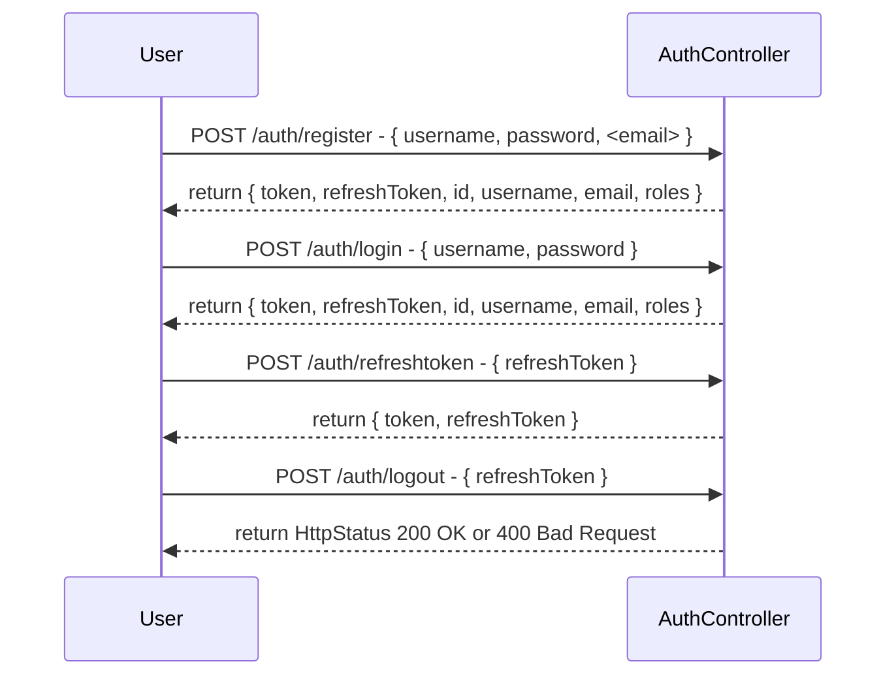

[](https://github.com/xBlizZer/demoAuth/actions)


# Login System with Java Spring Boot REST API

This is a simple Java Spring Boot REST API application that implements a login system. Users can register with a username and password, which are stored in an H2 memory database. Upon successful registration, users receive their user data, a JWT token, and a refresh token.

Users can then use the JWT token to call the REST API, which requires role-based authorization. If the JWT token expires, the user can use the refresh token to generate a new JWT token. If the refresh token expires, the user must re-login at the interface.

If the `dev` profile is used, test users are automatically generated. Test user is username `Jonas` and password `Test` with Roles `ROLE_ADMIN`and `ROLE_MEMBER`.



## Getting Started

### Prerequisites

To run this application, you need the following installed on your system:

- Java 17
- Maven

### Installation

1. Clone this repository: `git clone https://github.com/xBlizZer/SpringJWTAuth`
2. Navigate to the project directory: `cd SpringJWTAuth`
3. Run the application: `mvn spring-boot:run`

## Usage

### Registration

To register a new user, make a `POST` request to the `/auth/register` endpoint with a JSON body containing the `username`, `password` and `email` (optional) fields:

```json
{
  "username": "your_username",
  "password": "your_password",
  "email": "your_email"
}
```

If the registration is successful, the server responds with a JSON object containing the user data, JWT token, and refresh token:

```json
{
    "token": "Created JWT Token",
    "refreshToken": "Created Refresh Token",
    "id": 1,
    "username": "your_username",
    "email": "your_email",
    "roles": []
}
```
### Login Authentication
To authenticate a user and obtain a JWT token, make a `POST` request to the `/auth/login` endpoint with a JSON body containing the `username` and `password fields:

```json
{
  "username": "your_username",
  "password": "your_password"
}
```

If the credentials are valid, the server responds with a JSON object containing the user data and JWT token:

```json
{
    "token": "Created JWT Token",
    "refreshToken": "Created Refresh Token",
    "id": 1,
    "username": "your_username",
    "email": "your_email",
    "roles": []
}
```

### Accessing Protected Endpoints
To access protected endpoints that require role-based authorization, include the JWT token in the Authorization header of your requests with the Bearer prefix, like this:

`Authorization: Bearer your_jwt_token`

If the JWT token is valid and the user has the required role, the server will process the request accordingly. If the JWT token expires, you can use the refresh token to generate a new JWT token (see next section).

#### Example Protected Endpoint

To access a protected Endpoint, make a `GET` request to the `/auth/roles` endpoint with `Authorization: Bearer your_jwt_token`

Required Role is: `ROLE_ADMIN`

### Handling Expired Tokens

#### Expired JWT Token

If the JWT token expires, you request a new JWT token with your stored Refresh Token
Just make a `POST` request to the `/auth/refreshtoken` Endpoint

```json 
{
  "refreshToken": "Your stored Refresh Token"
}
```

If the Refresh Token is valid, the server responds with a JSON object containing the new JWT token and your current RefreshToken

```json 
{
  "token": "New created JWT Token", 
  "refreshToken": "Your stored Refresh Token"
}
```

#### Expired Refresh Token
If the JWT token expires, you need to re-login at the `/auth/login` endpoint to obtain a new JWT token.

### Contributing

If you would like to contribute to this project, please fork the repository and submit a pull request with your changes.

### License

This project is licensed under the MIT License
